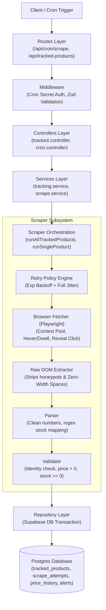
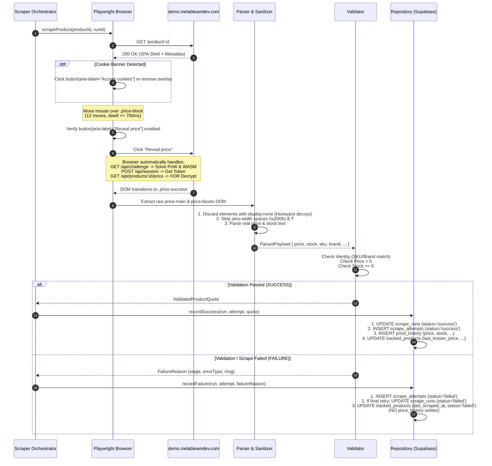

# System Architecture & Technical Design Document

**Project:** Product Price Tracker (INE Internship Assignment)  
**Status:** Phase 1 Design Specification (Pending Approval)  
**Target Store:** `https://demo.inelabteamdev.com/`

---

## 1. Monorepo Directory Structure

The project is structured as a clean, modular TypeScript monorepo with strict layer boundaries:

```
ine-price-tracker/
├── .github/
│   └── workflows/
│       └── ci.yml                     # Automated test runner on push/PR
├── docs/
│   ├── SCRAPER_RECONNAISSANCE.md      # Ground-truth findings from Phase 0
│   ├── DESIGN.md                      # System architecture & data contract (this file)
│   └── REQUIREMENTS_CHECKLIST.md      # Mapping of assignment requirements to code
├── database/
│   ├── migrations/
│   │   ├── 001_initial_schema.sql     # DDL for tracked_products, scrape_locks, scrape_runs, scrape_attempts, price_history, alerts
│   │   └── 002_invariants_triggers.sql# DB constraints & integrity enforcement triggers
│   └── seed.sql                       # Initial sample tracked products (e.g. products 12, 48, 675)
├── backend/
│   ├── src/
│   │   ├── config/                    # Environment variables, constants, schema validation (Zod)
│   │   ├── routes/                    # Express route definitions & middleware attachments
│   │   │   ├── health.routes.ts
│   │   │   ├── products.routes.ts
│   │   │   ├── tracked.routes.ts
│   │   │   └── cron.routes.ts
│   │   ├── controllers/               # Request parsing, HTTP status mapping, response formatting
│   │   │   ├── health.controller.ts
│   │   │   ├── products.controller.ts
│   │   │   ├── tracked.controller.ts
│   │   │   └── cron.controller.ts
│   │   ├── services/                  # Business logic & workflow orchestration
│   │   │   ├── product.service.ts     # Store search & metadata resolution
│   │   │   ├── tracking.service.ts    # Tracking management, history queries, alerts
│   │   │   └── alert.service.ts       # Alert generation on price drops / stock changes
│   │   ├── scraper/                   # Isolated Scraper Subsystem
│   │   │   ├── orchestrator.ts        # Batch & single product execution, concurrency limits
│   │   │   ├── retry.ts               # Exponential backoff + jitter policy & classification
│   │   │   ├── browser/
│   │   │   │   ├── browserPool.ts     # Playwright browser instance & context lifecycle
│   │   │   │   └── pageInteractions.ts# Dwell, mouse trajectory, reveal button, cookie dismissal
│   │   │   ├── parser/
│   │   │   │   ├── domParser.ts       # Extraction from live DOM / HTML; honeypot filtering
│   │   │   │   └── sanitizers.ts      # Zero-width space removal, currency/regex parsers
│   │   │   ├── validator/
│   │   │   │   ├── scraperValidator.ts# Strict validation rules (price > 0, stock >= 0)
│   │   │   │   └── errors.ts          # TransientError vs PermanentError classifications
│   │   │   └── fixtures/              # Mock HTML fixtures for deterministic test runs
│   │   │       ├── normal_page.html
│   │   │       ├── delayed_content.html
│   │   │       ├── malformed_price.html
│   │   │       ├── missing_stock.html
│   │   │       ├── decoy_honeypot.html
│   │   │       └── product_mismatch.html
│   │   ├── repositories/              # Supabase database access layer
│   │   │   ├── trackedProduct.repo.ts
│   │   │   ├── priceHistory.repo.ts
│   │   │   ├── scrapeRun.repo.ts
│   │   │   ├── scrapeAttempt.repo.ts
│   │   │   └── alert.repo.ts
│   │   ├── middleware/                # Helmet, CORS, cron secret auth, error handler
│   │   │   ├── auth.middleware.ts
│   │   │   ├── errorHandler.ts
│   │   │   └── validateRequest.ts
│   │   └── index.ts                   # Express server bootstrap
│   ├── .env.example
│   ├── package.json
│   └── tsconfig.json
├── frontend/
│   ├── src/
│   │   ├── api/                       # Typed client SDK hitting backend API
│   │   ├── components/
│   │   │   ├── layout/                # Header, navigation, container, badges
│   │   │   ├── products/              # Search bar, store search results, track button
│   │   │   ├── dashboard/             # Tracked products table, quick stats
│   │   │   ├── details/               # Price history chart, scrape attempt log table, "Run Now"
│   │   │   └── health/                # System health indicator, cron status, failure rate
│   │   ├── hooks/                     # SWR/React Query or custom fetch hooks
│   │   ├── pages/                     # DashboardPage, ProductDetailPage, HealthPage
│   │   ├── types/                     # Shared frontend TypeScript interfaces
│   │   ├── App.tsx
│   │   └── main.tsx
│   ├── index.html
│   ├── package.json
│   ├── vite.config.ts
│   └── tsconfig.json
├── tests/
│   ├── unit/
│   │   ├── parser.test.ts             # Decoy stripping, zero-width space filtering, regex
│   │   ├── validator.test.ts          # Rejection of price <= 0, missing stock, schema mismatch
│   │   └── retry.test.ts              # Exponential backoff timing, transient vs permanent categorization
│   ├── scraper/
│   │   ├── fixtureScraper.test.ts     # Scraper execution against static test fixtures
│   │   └── liveScraper.test.ts        # Real Playwright execution against demo site
│   └── api/
│       ├── products.test.ts           # Search, track, untrack, duplicate prevention
│       ├── cronAuth.test.ts           # Secret header authorization validation
│       └── concurrency.test.ts        # Concurrent scrape calls do not create duplicate history
├── package.json                       # Monorepo root scripts (dev, build, test, scrape:headed)
└── README.md
```

---

## 2. Supabase Postgres Schema & Non-Negotiable Invariants

### Schema Overview & Invariant Rules
> [!IMPORTANT]
> **Core Integrity Invariants:**
> 1. **Verified Success Invariant:** A `price_history` row **may ONLY be written after a scrape attempt succeeds AND validation passes**.
>    - **Never** write `price_history` on: timeout, network failure, missing price, missing stock, malformed data, challenge failure, selector/schema mismatch, or product identity mismatch.
> 2. **Product Identity Invariant:** A `price_history` row **must belong to the exact same `tracked_product_id` as the referenced `scrape_attempt`**. It is strictly prohibited from referencing an attempt belonging to a different product (enforced by composite foreign key + trigger).
> 3. **Non-Overwriting Invariant:** A failed attempt **must always** write a `scrape_attempts` row with diagnostic data, but **must NEVER overwrite** `last_known_price` or `last_known_stock` on `tracked_products`.
> 4. **Strict Idempotency Invariant:** A single scrape attempt can create **at most one** `price_history` record (`UNIQUE (scrape_attempt_id)`), and concurrent or repeated cron/manual triggers are guarded by Postgres advisory locks and time-window deduplication.

### SQL Schema Definition (`database/migrations/001_initial_schema.sql`)

```sql
-- Enable UUID generation
CREATE EXTENSION IF NOT EXISTS "uuid-ossp";

-- 1. TRACKED PRODUCTS TABLE
CREATE TABLE tracked_products (
    id UUID PRIMARY KEY DEFAULT uuid_generate_v4(),
    store_product_id VARCHAR(64) NOT NULL UNIQUE,       -- e.g. "12", "48", "675"
    slug VARCHAR(255) NOT NULL,
    name VARCHAR(255) NOT NULL,
    brand VARCHAR(128) NOT NULL,
    category VARCHAR(128) NOT NULL,
    sku VARCHAR(128) NOT NULL,
    target_url TEXT NOT NULL,
    is_active BOOLEAN NOT NULL DEFAULT true,
    
    -- Cache fields (Only updated on SUCCESSFUL scrape)
    last_known_price NUMERIC(12, 2) NULL,
    last_known_mrp NUMERIC(12, 2) NULL,
    last_known_stock INT NULL,
    last_known_stock_status VARCHAR(32) NULL CHECK (last_known_stock_status IN ('in_stock', 'out_of_stock')),
    
    -- Scrape metadata
    last_scraped_at TIMESTAMPTZ NULL,
    last_scrape_status VARCHAR(32) NOT NULL DEFAULT 'pending' CHECK (last_scrape_status IN ('pending', 'success', 'failed')),
    consecutive_failures INT NOT NULL DEFAULT 0,
    
    created_at TIMESTAMPTZ NOT NULL DEFAULT NOW(),
    updated_at TIMESTAMPTZ NOT NULL DEFAULT NOW()
);

-- Index for fast lookup by store ID and active status
CREATE INDEX idx_tracked_products_store_id ON tracked_products(store_product_id);
CREATE INDEX idx_tracked_products_active ON tracked_products(is_active);

-- 2. SCRAPE LOCKS TABLE (Application-Level Concurrency Lock)
CREATE TABLE scrape_locks (
    tracked_product_id UUID PRIMARY KEY REFERENCES tracked_products(id) ON DELETE CASCADE,
    lock_token UUID NOT NULL,
    acquired_at TIMESTAMPTZ NOT NULL DEFAULT NOW(),
    expires_at TIMESTAMPTZ NOT NULL
);

-- 3. SCRAPE RUNS TABLE (Overall execution outcome for a product)
CREATE TABLE scrape_runs (
    id UUID PRIMARY KEY DEFAULT uuid_generate_v4(),
    tracked_product_id UUID NOT NULL REFERENCES tracked_products(id) ON DELETE CASCADE,
    job_id UUID NOT NULL,                              -- Correlation ID grouping a full batch/cron run
    status VARCHAR(32) NOT NULL DEFAULT 'pending' CHECK (status IN ('pending', 'success', 'failed')),
    started_at TIMESTAMPTZ NOT NULL DEFAULT NOW(),
    completed_at TIMESTAMPTZ NULL,

    -- Composite unique key used for strict relational foreign key verification by scrape_attempts
    CONSTRAINT uq_scrape_runs_id_product UNIQUE (id, tracked_product_id)
);

CREATE INDEX idx_scrape_runs_product_time ON scrape_runs(tracked_product_id, started_at DESC);

-- 4. SCRAPE ATTEMPTS TABLE (Auditing and diagnosis for every individual retry)
CREATE TABLE scrape_attempts (
    id UUID PRIMARY KEY DEFAULT uuid_generate_v4(),
    scrape_run_id UUID NOT NULL,
    tracked_product_id UUID NOT NULL REFERENCES tracked_products(id) ON DELETE CASCADE,
    attempt_number INT NOT NULL DEFAULT 1,
    status VARCHAR(32) NOT NULL CHECK (status IN ('success', 'failed')),
    duration_ms INT NOT NULL,
    
    -- Diagnostic information (populated on failure)
    failure_stage VARCHAR(64) NULL CHECK (failure_stage IN (
        'navigation',
        'cookie_dismissal',
        'interaction_hover',
        'challenge_token',
        'price_fetch',
        'dom_render',
        'parsing',
        'validation',
        'identity_mismatch',
        'timeout'
    )),
    error_type VARCHAR(64) NULL CHECK (error_type IN (
        'transient_timeout',
        'transient_network',
        'transient_5xx',
        'transient_rate_limit',
        'permanent_validation',
        'permanent_identity_mismatch',
        'permanent_selector_missing',
        'permanent_parse_error'
    )),
    error_message TEXT NULL,
    
    -- Raw extracted strings for debugging
    raw_price_text TEXT NULL,
    raw_stock_text TEXT NULL,
    
    scraped_at TIMESTAMPTZ NOT NULL DEFAULT NOW(),

    -- Composite Foreign Key: Relational guarantee that scrape_attempts.tracked_product_id
    -- strictly matches the referenced scrape_runs.tracked_product_id
    CONSTRAINT fk_scrape_attempts_run_product FOREIGN KEY (scrape_run_id, tracked_product_id)
        REFERENCES scrape_runs(id, tracked_product_id) ON DELETE RESTRICT,

    -- Idempotency & composite integrity constraints:
    -- A run cannot record the same attempt number twice
    CONSTRAINT uq_scrape_attempts_run_attempt UNIQUE (scrape_run_id, attempt_number),
    -- Composite unique key used for strict relational foreign key verification by price_history
    CONSTRAINT uq_scrape_attempts_id_product UNIQUE (id, tracked_product_id)
);

CREATE INDEX idx_scrape_attempts_run_id ON scrape_attempts(scrape_run_id);

-- 5. PRICE HISTORY TABLE (Immutable audit trail of valid prices)
CREATE TABLE price_history (
    id UUID PRIMARY KEY DEFAULT uuid_generate_v4(),
    tracked_product_id UUID NOT NULL REFERENCES tracked_products(id) ON DELETE CASCADE,
    scrape_attempt_id UUID NOT NULL,
    
    -- Verified price & stock data (Strictly verified > 0 and >= 0)
    price NUMERIC(12, 2) NOT NULL CHECK (price > 0),
    mrp NUMERIC(12, 2) NULL CHECK (mrp IS NULL OR mrp >= price),
    currency VARCHAR(8) NOT NULL DEFAULT 'INR',
    stock INT NOT NULL CHECK (stock >= 0),
    stock_status VARCHAR(32) NOT NULL CHECK (stock_status IN ('in_stock', 'out_of_stock')),
    
    seller VARCHAR(255) NULL,
    discount_pct INT NULL,
    rating NUMERIC(3, 2) NULL,
    recorded_at TIMESTAMPTZ NOT NULL DEFAULT NOW(),

    -- Idempotency constraint: An individual scrape attempt can create AT MOST ONE price_history row
    CONSTRAINT uq_price_history_attempt UNIQUE (scrape_attempt_id),

    -- Composite Foreign Key: Relational guarantee that price_history.tracked_product_id
    -- strictly matches the referenced scrape_attempts.tracked_product_id
    CONSTRAINT fk_price_history_attempt_product FOREIGN KEY (scrape_attempt_id, tracked_product_id)
        REFERENCES scrape_attempts(id, tracked_product_id) ON DELETE RESTRICT
);

CREATE INDEX idx_price_history_product_time ON price_history(tracked_product_id, recorded_at DESC);

-- 6. ALERTS TABLE
CREATE TABLE alerts (
    id UUID PRIMARY KEY DEFAULT uuid_generate_v4(),
    tracked_product_id UUID NOT NULL REFERENCES tracked_products(id) ON DELETE CASCADE,
    price_history_id UUID NULL REFERENCES price_history(id) ON DELETE SET NULL,
    alert_type VARCHAR(64) NOT NULL CHECK (alert_type IN ('price_drop', 'out_of_stock', 'back_in_stock', 'failure_streak')),
    title VARCHAR(255) NOT NULL,
    message TEXT NOT NULL,
    payload JSONB NULL,
    is_read BOOLEAN NOT NULL DEFAULT false,
    created_at TIMESTAMPTZ NOT NULL DEFAULT NOW()
);

CREATE INDEX idx_alerts_unread ON alerts(is_read, created_at DESC);
```

### Database Invariant Enforcement Trigger (`database/migrations/002_invariants_triggers.sql`)

To guarantee data integrity even in the event of application bugs or direct database operations:

```sql
-- Trigger: Enforce that price_history can ONLY be written if:
-- 1. The referenced scrape_attempt exists.
-- 2. The referenced scrape_attempt succeeded (status = 'success').
-- 3. The referenced scrape_attempt belongs to the EXACT SAME tracked_product_id.
CREATE OR REPLACE FUNCTION enforce_price_history_success_invariant()
RETURNS TRIGGER AS $$
DECLARE
    v_attempt_status VARCHAR(32);
    v_attempt_product_id UUID;
BEGIN
    SELECT status, tracked_product_id 
    INTO v_attempt_status, v_attempt_product_id 
    FROM scrape_attempts 
    WHERE id = NEW.scrape_attempt_id;
    
    -- Check 1: Existence
    IF v_attempt_status IS NULL THEN
        RAISE EXCEPTION 'Invariant violation: Referenced scrape_attempt % does not exist', NEW.scrape_attempt_id;
    END IF;
    
    -- Check 2: Success Status
    IF v_attempt_status != 'success' THEN
        RAISE EXCEPTION 'Invariant violation: A price_history row may ONLY be written after a scrape attempt succeeds. Referenced scrape_attempt % has status "%"',
            NEW.scrape_attempt_id, v_attempt_status;
    END IF;
    
    -- Check 3: Product Identity Alignment
    IF v_attempt_product_id != NEW.tracked_product_id THEN
        RAISE EXCEPTION 'Invariant violation: Product mismatch! price_history.tracked_product_id (%) does not match referenced scrape_attempts.tracked_product_id (%)',
            NEW.tracked_product_id, v_attempt_product_id;
    END IF;
    
    RETURN NEW;
END;
$$ LANGUAGE plpgsql;

CREATE TRIGGER trg_enforce_price_history_invariant
BEFORE INSERT ON price_history
FOR EACH ROW
EXECUTE FUNCTION enforce_price_history_success_invariant();
```

### Idempotency Strategy for Scrape Executions & Price Records

To prevent duplicate cron triggers, overlapping executions, or network retries from unintentionally creating duplicate records:

1. **Database-Level Unique Constraints (Structural Idempotency):**
   - `CONSTRAINT uq_price_history_attempt UNIQUE (scrape_attempt_id)`: Enforces a strict 1:1 relationship between an individual scrape attempt and price history. An attempt cannot be written twice.
   - `CONSTRAINT uq_scrape_attempts_run_attempt UNIQUE (scrape_run_id, attempt_number)`: Guarantees that within any given product scrape run, each attempt number is strictly unique.

2. **Concurrency & Overlap Lock (PostgreSQL Application-Level Lock Table):**
   - **Requirement:** A long-running PostgreSQL transaction MUST NOT be held open while Playwright is actively scraping.
   - **Configuration:** The lock TTL is dynamically configured via the environment variable `SCRAPE_LOCK_TTL_MS` (e.g., `900000` for 15 minutes). The system guarantees that the **maximum total scrape execution time** (including all retries, navigation timeouts, and challenge solves) is strictly bounded and guaranteed to be less than `SCRAPE_LOCK_TTL_MS`.
   - When a cron or manual scrape begins for product $P$, the orchestrator generates a `lock_token` (UUID) and attempts to acquire a lock via the `scrape_locks` table.
   - **Acquisition:**
     ```sql
     INSERT INTO scrape_locks (tracked_product_id, lock_token, expires_at) 
     VALUES ($1, $2, NOW() + ($3::int || ' milliseconds')::interval)
     ON CONFLICT (tracked_product_id) DO UPDATE 
     SET lock_token = EXCLUDED.lock_token, 
         acquired_at = NOW(), 
         expires_at = EXCLUDED.expires_at
     WHERE scrape_locks.expires_at < NOW()
     RETURNING lock_token;
     ```
     *(Where `$3` is the `SCRAPE_LOCK_TTL_MS` value)*. If the query returns a row, the lock is successfully acquired and the scrape proceeds. If no row is returned, an active lock exists and the execution responds with `409 Conflict ("Scrape already in progress for this product")`. This acquisition occurs instantaneously and the database transaction is immediately committed.
   - **Release:** The orchestrator explicitly releases the lock in a `finally` block when the scrape run finishes (whether it succeeds or fails) by matching the token to ensure it only releases its own lock:
     ```sql
     DELETE FROM scrape_locks 
     WHERE tracked_product_id = $1 AND lock_token = $2;
     ```
   - **Crash Recovery:** If the Node.js process crashes or the Playwright browser hangs indefinitely, the lock will eventually expire (when `NOW() > expires_at`). A subsequent scrape attempt will safely overwrite and reclaim the expired lock via the `WHERE scrape_locks.expires_at < NOW()` condition in the acquisition query.

3. **Time-Window Cooldown / Deduping (Noise Reduction):**
   - If a manual trigger or duplicate cron request is received for product $P$ where `last_scraped_at > NOW() - INTERVAL '5 minutes'` and `last_scrape_status = 'success'`, the service returns the existing cached quote without issuing duplicate browser tasks or creating duplicate records.
   - For writing history, the repository uses:
     ```sql
     INSERT INTO price_history (...) VALUES (...)
     ON CONFLICT (scrape_attempt_id) DO NOTHING;
     ```

---

## 3. Scraper Module Boundary & Layer Architecture



### Layer Responsibilities

1. **Routes (`backend/src/routes/`):**
   - Pure routing and HTTP verb declarations.
   - Attaches `authMiddleware` (validates `X-Cron-Secret` header for `/api/cron/scrape`).
   - Attaches schema validation middleware (`validateRequest(trackProductSchema)`).
   - **No scraping, business, or DB logic.**

2. **Controllers (`backend/src/controllers/`):**
   - Extracts typed request inputs (`req.params`, `req.query`, `req.body`).
   - Delegates execution to the appropriate service.
   - Maps outcome to HTTP status codes (`200 OK`, `201 Created`, `400 Bad Request`, `404 Not Found`, `500 Server Error`).

3. **Services (`backend/src/services/`):**
   - High-level business flows.
   - `TrackingService.trackProduct(storeProductId)`: fetches store metadata, prevents duplicate tracking, triggers initial scrape.
   - `ScrapeService.executeCronScrape()`: initiates batch scraping across all active tracked products.
   - `AlertService.evaluateAlerts(product, oldPrice, newPrice, oldStock, newStock)`: creates alerts when threshold drops occur.

4. **Scraper Orchestrator (`backend/src/scraper/orchestrator.ts`):**
   - Generates a UUID `run_id` for traceability.
   - Implements bounded concurrency (max 2 parallel Playwright pages to respect server and client limits).
   - Isolates individual product scrape jobs: **a failure in product A never aborts product B**.
   - Executes the retry policy loop for transient errors.

5. **Browser Fetcher (`backend/src/scraper/browser/`):**
   - Directly addresses Phase 0 reconnaissance findings:
     - Dispatches smooth mouse trajectory coordinates over `.price-block` ($\ge 8$ moves, $\ge 600$ms dwell time) to satisfy the client-side `Ar` activity tracker.
     - Monitors and dismisses the random cookie overlay (`.cookie-overlay`) if rendered.
     - Waits for `button[aria-label="Reveal price"]` to become enabled.
     - Clicks reveal and waits for `.price-success` or catches `.price-error`.
     - Supports `SCRAPER_MODE=fixture` for deterministic unit testing without hitting the network.

6. **Parser (`backend/src/scraper/parser/`):**
   - **Filters out Honeypot Decoys:** Ignores elements with `display: none;` (`.price-value[style*="display: none"]` and `[data-price="true"]`).
   - **De-obfuscates text:** Removes zero-width spaces (`\u200b`), currency markers (`₹`), and commas.
   - **Parses Stock:** Translates text into integer stock ($s \ge 0$) and enum status (`in_stock` / `out_of_stock`).
   - **Strict Null Handling:** If price or stock cannot be parsed, returns `null` (never defaults to 0 or arbitrary status).

7. **Validator (`backend/src/scraper/validator/`):**
   - Validates **Product Identity**: verifies page SKU/Brand matches DB record.
   - Validates **Price**: ensures $price > 0$ and is finite.
   - Validates **Stock**: ensures $stock \ge 0$ and matches badge status.
   - Classifies any failure into `TransientError` vs `PermanentError`.

8. **Repository (`backend/src/repositories/`):**
   - Encapsulates database transactions.
   - Enforces the persistence invariant: only commits to `price_history` if attempt succeeded and validation passed.

---

## 4. Grounded Scraper Execution Flow

Based directly on the reverse-engineered store mechanisms discovered in Phase 0:



---

## 5. Retry Policy & Error Classification

### Policy Rules
- **Maximum Retries:** 3 attempts (1 initial attempt + max 2 retries).
- **Backoff Formula:** Exponential backoff with Full Jitter:
  $$\text{Delay}(n) = \text{random}(0, \min(\text{MaxDelay}, \text{BaseDelay} \times 2^n))$$
  Where $\text{BaseDelay} = 1000\text{ms}$, $\text{MaxDelay} = 8000\text{ms}$.
- **Failure Classification Matrix:**

| Failure Type | Category | Action | Diagnostic `failure_stage` |
| :--- | :--- | :--- | :--- |
| **Page Navigation Timeout** | Transient | **Retry** with exponential backoff | `navigation` |
| **Reveal Button Dwell Timeout** | Transient | **Retry** (adjust mouse path) | `interaction_hover` |
| **HTTP 429 Too Many Requests** | Transient | **Retry** with backoff / delay | `price_fetch` |
| **Store Retrying Phase (`jr=6`)** | Transient | **Retry** | `price_fetch` |
| **Store 5xx Internal Error** | Transient | **Retry** | `price_fetch` |
| **Product Identity Mismatch** | Permanent | **ABORT RETRIES** immediately | `identity_mismatch` |
| **HTTP 404 (Product Missing)** | Permanent | **ABORT RETRIES** immediately | `navigation` |
| **Missing Price in DOM** | Permanent | **ABORT RETRIES** (do not guess) | `parsing` |
| **Missing Stock in DOM** | Permanent | **ABORT RETRIES** (do not guess) | `parsing` |
| **Price $\le 0$ or NaN** | Permanent | **ABORT RETRIES** | `validation` |
| **Stock $< 0$ or Unparseable** | Permanent | **ABORT RETRIES** | `validation` |

---

## 6. Persistence & Data Integrity Flow

The following decision logic governs every database write operation:

```mermaid
flowchart TD
    Start([Scrape Completed]) --> CheckError{Did scrape or<br/>network throw error?}
    
    CheckError -- Yes --> LogFail[Log Failed Scrape Attempt]
    CheckError -- No --> CheckParse{Did parser extract<br/>price AND stock?}
    
    CheckParse -- No (Missing Data) --> LogFail
    CheckParse -- Yes --> CheckIdentity{Does SKU & Brand<br/>match tracked product?}
    
    CheckIdentity -- Mismatch --> LogFail
    CheckIdentity -- Match --> CheckRules{Validation Rules:<br/>price > 0 AND stock >= 0?}
    
    CheckRules -- Invalid --> LogFail
    CheckRules -- Valid --> DBSuccess[DB Transaction: SUCCESS]
    
    subgraph Success Transaction
        DBSuccess --> W0[1. UPDATE scrape_runs<br/>status='success', completed_at=NOW()]
        W0 --> W1[2. INSERT INTO scrape_attempts<br/>status='success', duration_ms]
        W1 --> W2[3. INSERT INTO price_history<br/>price, mrp, stock, seller, etc.]
        W2 --> W3[4. UPDATE tracked_products<br/>SET last_known_price = price,<br/>last_known_stock = stock,<br/>last_scrape_status = 'success',<br/>consecutive_failures = 0]
        W3 --> CheckAlerts{Price drop or<br/>Stock change?}
        CheckAlerts -- Yes --> W4[5. INSERT INTO alerts]
        CheckAlerts -- No --> Done([Complete])
        W4 --> Done
    end
    
    subgraph Failure Transaction
        LogFail --> F0[1. INSERT INTO scrape_attempts<br/>status='failed', failure_stage,<br/>error_type, error_message]
        F0 --> FCheck{Is this the<br/>final retry?}
        FCheck -- No --> RetryFlow[Schedule Retry<br/>Run stays 'pending']
        FCheck -- Yes --> F1[2. UPDATE scrape_runs<br/>status='failed', completed_at=NOW()]
        F1 --> F2[3. UPDATE tracked_products<br/>SET last_scraped_at = NOW(),<br/>last_scrape_status = 'failed',<br/>consecutive_failures = consecutive_failures + 1]
        F2 --> Preserved["last_known_price & last_known_stock<br/>REMAIN UNCHANGED"]
        Preserved --> CheckStreak{consecutive_failures >= 3?}
        CheckStreak -- Yes --> F3[4. INSERT INTO alerts<br/>type='failure_streak']
        CheckStreak -- No --> DoneFail([Complete])
        F3 --> DoneFail
    end
```

---

## 7. Development Roadmap & Milestones

1. **Phase 1 (Current):** System Architecture, Directory Tree & Schema approval (`docs/DESIGN.md`).
2. **Phase 2:** Database migration execution on Supabase + Express backend core (`/api/health`, `/api/tracked-products`, `/api/cron/scrape`).
3. **Phase 3:** Headed & headless Playwright scraper with retry policy and fixture mode.
4. **Phase 4:** React/Vite dashboard frontend with search, tracking, price charts, and scrape logs.
5. **Phase 5:** Comprehensive unit, fixture, API, and concurrency test suites.
6. **Phase 6:** Cloud deployment (Backend to Render, Frontend to Vercel, DB to Supabase, Cron via cron-job.org).
7. **Phase 7:** Documentation audit & integrity review.
